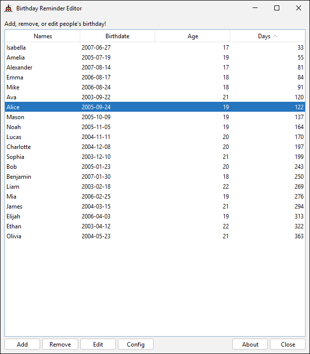

# 🎂 BirthdayReminder
🍰🎉 Never forget any of your friends' birthdays with this one!

---
## How to Use
After launching BirthdayReminder, a tray icon will appear on your taskbar.
Right-click the icon to open a pop-up menu, then click the `Open` option.
This will bring up the editor, where you can add, remove, or edit
people's birthdays. You can also configure it to play a sound when it's
someone's birthday!

---
## Start on Computer Boot 🚀
Currently, you need to manually set this application to auto-start 
with your operating system. BirthdayReminder checks if it is someone's 
birthday today when it is launched.